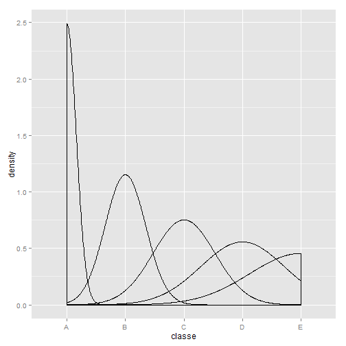

Practical Machine Learning- Prediction Assignment Writeup
========================================================

This project is about predicting the user activity in the form of the excercise. The data is collected Using devices such as Jawbone Up, Nike FuelBand, and Fitbit it is now possible to collect a large amount of data about personal activity relatively inexpensively. Goal will be to use data from accelerometers on the belt, forearm, arm, and dumbell of 6 participants. They were asked to perform barbell lifts correctly and incorrectly in 5 different ways. More information is available from the website here: http://groupware.les.inf.puc-rio.br/har .

The goal of of this analysis was to predict the classe variable using data.
Actual meaning of the variables was ignored for this analysis.

## The data is divided into Training set and Test Set.


Training data set 
-----------------
<a href="https://d396qusza40orc.cloudfront.net/predmachlearn/pml-training.csv">pml-training.csv</a>

Testing data set
-----------------
<a href="https://d396qusza40orc.cloudfront.net/predmachlearn/pml-testing.csv">pml-testing.csv</a>

# Setting up the libraris and environment options

```
## randomForest 4.6-7
## Type rfNews() to see new features/changes/bug fixes.
## Loading required package: lattice
## Loading required package: ggplot2
```


## Reading and Cleaning the data
* Data is read from the working directory.

```r
train <- read.csv("pml-training.csv")
test <- read.csv("pml-testing.csv")
```


```r
tsize <- 1000
cvsize <- 3000
```

* Columns are ignored which are not useful.

```r
ccs <- which(sapply(names(train), function(i) class(train[, i])) != "factor")
classe <- train$classe
train <- train[, ccs]
test <- test[, ccs]
```

* Clean the data where NA and timestamps are cleaned

```r
sapply(1:ncol(train), function(i) nrow(train[is.na(train[, i]), ]))
```

```
##   [1]     0     0     0     0     0     0     0     0 19216 19216 19216
##  [12] 19216 19216 19216 19216 19216 19216 19216 19216 19216 19216 19216
##  [23] 19216 19216     0     0     0     0     0     0     0     0     0
##  [34]     0     0     0     0 19216 19216 19216 19216 19216 19216 19216
##  [45] 19216 19216 19216     0     0     0     0     0     0     0     0
##  [56]     0 19216 19216 19216 19216 19216 19216 19216 19216 19216     0
##  [67]     0     0 19216 19216 19216 19216 19216 19216     0 19216 19216
##  [78] 19216 19216 19216 19216 19216 19216 19216 19216     0     0     0
##  [89]     0     0     0     0     0     0     0     0     0 19216 19216
## [100] 19216 19216 19216 19216     0 19216 19216 19216 19216 19216 19216
## [111] 19216 19216 19216 19216     0     0     0     0     0     0     0
## [122]     0     0
```

```r
sapply(1:ncol(test), function(i) nrow(test[is.na(test[, i]), ]))
```

```
##   [1]  0  0  0  0  0  0  0  0 20 20 20 20 20 20 20 20 20 20 20 20 20 20 20
##  [24] 20  0  0  0  0  0  0  0  0  0  0  0  0  0 20 20 20 20 20 20 20 20 20
##  [47] 20  0  0  0  0  0  0  0  0  0 20 20 20 20 20 20 20 20 20  0  0  0 20
##  [70] 20 20 20 20 20  0 20 20 20 20 20 20 20 20 20 20  0  0  0  0  0  0  0
##  [93]  0  0  0  0  0 20 20 20 20 20 20  0 20 20 20 20 20 20 20 20 20 20  0
## [116]  0  0  0  0  0  0  0  0
```

```r
nacols <- which(sapply(1:ncol(test), function(i) all(is.na(test[, i]))))
test <- test[, -c(1:4, nacols)]
train <- train[, -c(1:4, nacols)]
```

## Plot the graph to look at the variables density i.e to understand the pattern of different exercises 

```r
qplot(classe, data = train, geom = "density")
```

 


## Build the classification model
* I will use random forest with default settings, it will helps as there is no need to for cross-validation.Estimations is done internally.
check the summary.
Use seed data to reduce the processing time.

```r
set.seed(1000)
samp <- sample(1:nrow(train), tsize)
trn <- train[samp, ]
cs <- classe[samp]
modelfit <- train(cs ~ ., method = "rf", data = trn, verbose = FALSE)

pred <- predict(modelfit, test)
```


```r
confusion = modelfit$confusion
sensitivity = (confusion[2, 2]/(confusion[2, 2] + confusion[2, 1])) * 100
specificity = (confusion[1, 1]/(confusion[1, 1] + confusion[1, 2])) * 100
overall_error = modelfit$err.rate[length(modelfit$err.rate[, 1]), 1] * 100
overall_accuracy = 1 - overall_error
class1_error = paste(rownames(confusion)[1], " error rate= ", confusion[1, 3], 
    sep = "")
class2_error = paste(rownames(confusion)[2], " error rate= ", confusion[2, 3], 
    sep = "")
overall_accuracy = 100 - overall_error
```

## Check the summary to see how the model has performed

```r
summary(modelfit)
```

```
##                 Length Class      Mode     
## call               5   -none-     call     
## type               1   -none-     character
## predicted       1000   factor     numeric  
## err.rate        3000   -none-     numeric  
## confusion         30   -none-     numeric  
## votes           5000   matrix     numeric  
## oob.times       1000   -none-     numeric  
## classes            5   -none-     character
## importance        52   -none-     numeric  
## importanceSD       0   -none-     NULL     
## localImportance    0   -none-     NULL     
## proximity          0   -none-     NULL     
## ntree              1   -none-     numeric  
## mtry               1   -none-     numeric  
## forest            14   -none-     list     
## y               1000   factor     numeric  
## test               0   -none-     NULL     
## inbag              0   -none-     NULL     
## xNames            52   -none-     character
## problemType        1   -none-     character
## tuneValue          1   data.frame list     
## obsLevels          5   -none-     character
```

